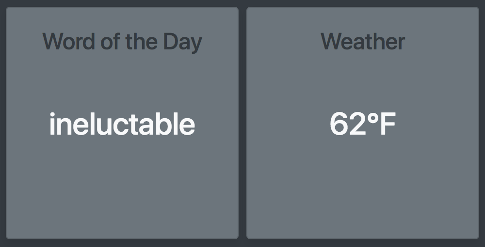

# dash
Simple express/bootstrap parser and dashboard

## Parser
* Parse content from webpages and APIs and save it to `db.json`
* Example usage in `parser.js`

```javascript
var parser = require('./parserCommon.js');

// Quote (HTML parsing example)
parser.parse('Word of the Day',
'https://www.merriam-webster.com/word-of-the-day',
'.word-and-pronunciation h1');

// Temperature (API example)
function getTempF(res) {
  return Math.round(res.main.temp * 9/5 - 459.67).toString() + '°F';
}

var options = {url: 'http://api.openweathermap.org/data/2.5/weather?zip=94105,us&appid=APIKEY'};
parser.req('Weather', options, getTempF);
```

* Run `node parser.js` periodically using cron or [node-schedule](https://www.npmjs.com/package/node-schedule)
* Resulting JSON

```javascript
{
  "Word of the Day": "ineluctable",
  "Weather": "62°F"
}
```

## Dashboard
* The dashboard can be used independently from the parser.
* The server and browser will reload if changes are detected in `db.json` file.
* Output of `localhost:3000` after running `node app.js`

