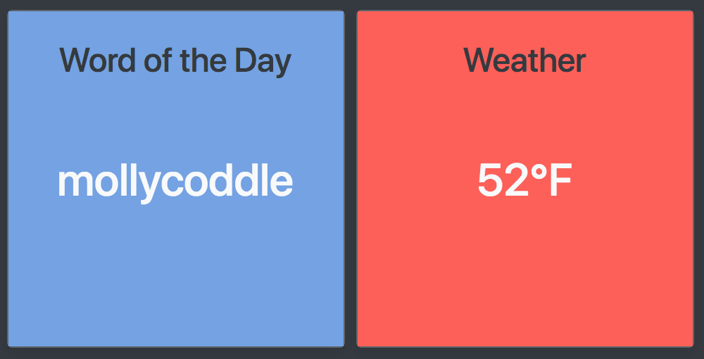

# dash
Simple express/bootstrap parser and dashboard

## Parser
* Parses content from webpages and APIs and saves it to `db.json`
* Ability to set optional values:
    * `color`: e.g. `#FF0000`
    * `url` with `target` (optional):
       * `_none`: makes an async get request (nothing appears in the browser)
       * `_self`: opens in current tab
       * `_blank`: opens in new tab (default)
* Example usage in `parser.js`

```javascript
var parser = require('./parserCommon.js');

function getTempF(res) {
  return Math.round(res.main.temp * 9/5 - 459.67).toString() + '°F';
}

parser.schedule(5, () => { // Every 5 minutes
  // Quote
  parser.parse('Word of the Day',
  'https://www.merriam-webster.com/word-of-the-day',
  '.word-and-pronunciation h1', null, '#72A1E5');

  // Temperature
  var options = {url: 'http://api.openweathermap.org/data/2.5/weather?zip=94105,us&appid=YOUR_API_KEY_HERE'};
  parser.req('Weather', options, getTempF, '#FE5F55', 'http://openweathermap.org/city/5391959', '_blank');
})
```

* Run `node parser.js`
* Resulting JSON

```javascript
{
  "Word of the Day": {
    "text": "mollycoddle",
    "color": "#72A1E5",
    "url": "https://www.merriam-webster.com/word-of-the-day"
  },
  "Weather": {
    "text": "52°F",
    "color": "#FE5F55",
    "url": "https://openweathermap.org/city/5391959"
    "target": "_blank"
  }
}
```

## Dashboard
* The dashboard can be used independently.
* The server and browser will reload if changes are detected in `db.json`
* Output of `localhost:3000` after running `node app.js`

  
